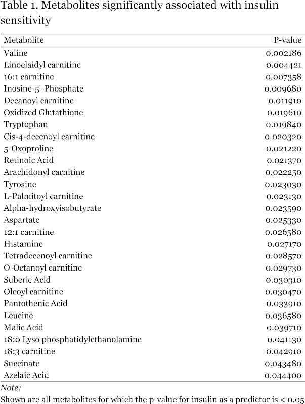
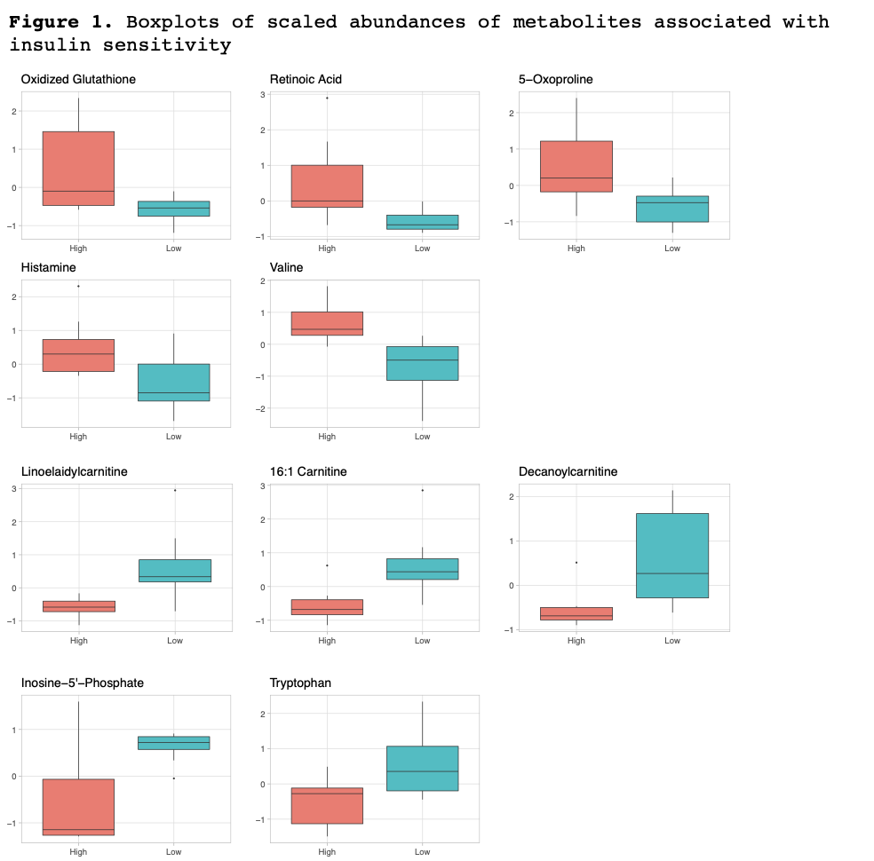
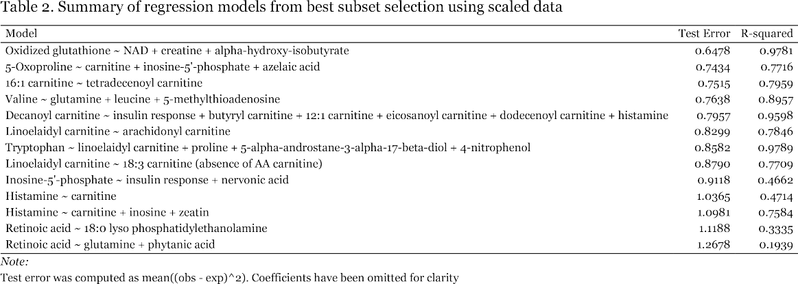
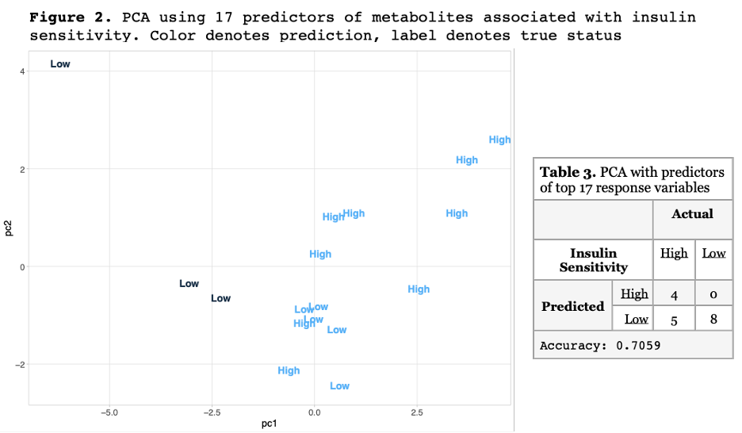
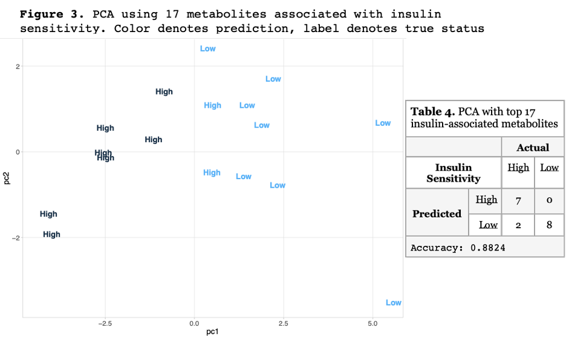
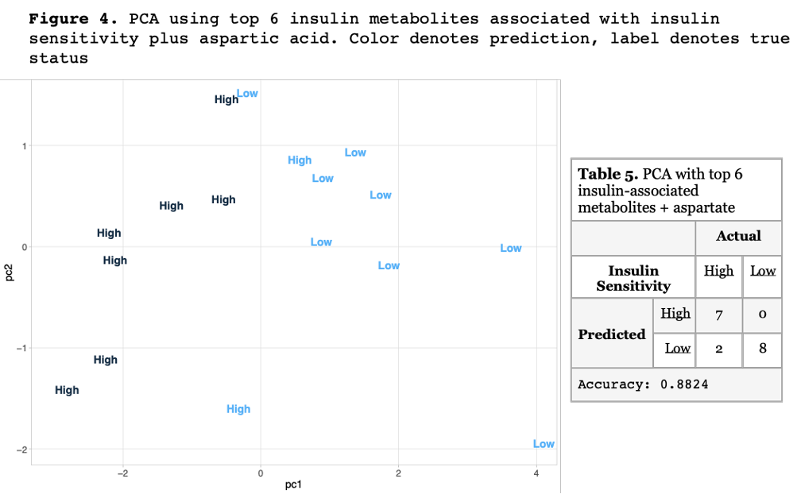
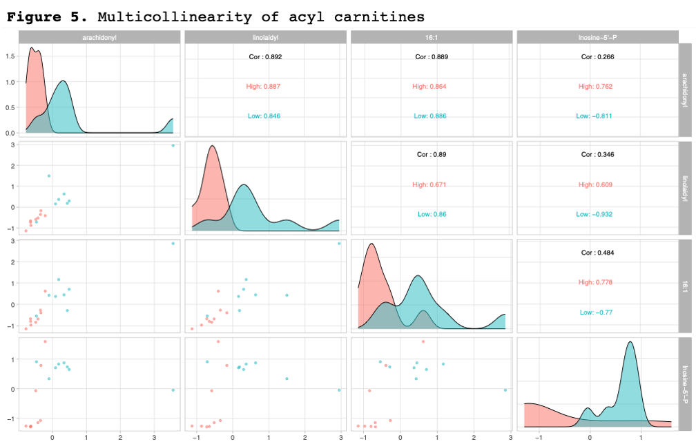

<!--This README is for the CS287 Data Science I final project-->

# Metabolomics of Muscle in Insulin Sensitive and Resistant Obese Subjects via Tandem Liquid Chromatography-Mass Spectrometry

## Abstract

Metabolic syndrome involves the intersection of obesity, cardiovascular disease, and insulin resistance. The prevalence of metabolic syndrome worldwide, but especially in the United States, has risen due to the prominent rise in the prevalence of obesity over the past few decades. Numerous people are now at risk of serious life-limiting chronic disease, if their insulin resistance progresses to type 2 diabetes. Metabolomics is the large scale profiling of metabolites in blood plasma and tissues via mass spectrometry that may distinguish patients with metabolic syndrome likely to develop more serious chronic conditions. I have analyzed data from a small scale pilot study of 28 obese individuals with metabolic syndrome, differing in their insulin sensitivity, where hundreds of metabolites from muscle biopsies were examined by tandem liquid chromatography and mass spectrometry. The abundances of several metabolites involving fatty acid oxidation, carbohydrate utilization, hydrophobic amino acids, and general indicators of oxidative metabolism like glutathione and NAD were found to vary based on subjects’ insulin sensitivity. Furthermore, principal component analysis followed by K-means clustering using metabolites associated with insulin sensitivity was able to mirror the division of subjects based on their insulin sensitivity at the beginning of the study.

## Keywords

metabolic syndrome, insulin sensitivity, mass spectrometry, principal components analysis, kmeans
clustering

## Introduction

Between 1975 and 2016 the global prevalence of obesity nearly tripled. Among children aged 5 to 19 it has more than quadrupled1. According to the World Health Organization, we are facing a global pandemic of obesity with nearly 2 billion overweight people in the world as of 2016, of which 650 million were obese. In the American South and Midwest the prevalence of metabolic syndrome, a constellation of risk factors involving high blood pressure, altered fat metabolism, insulin resistance (leading to the inability to regulate blood glucose concentration), and abdominal obesity, reaches to between 35 and 40%2. Metabolic syndrome (MetS) elevates an individual’s risk of diabetes by 5-fold, cardiovascular disease by 2-fold, and predisposes one to a host of other comorbidities that negatively affect lifespan3.  According to a review of the National Health and Nutrition Examination Survey data for the period spanning 2003 to 2014, as of 2014 there were 50 million adults in the United States with MetS and 30 million with diabetes4. The economic costs of obesity and its comorbidities in the United States have topped $1.7 trillion, an amount that includes nearly $481 billion in direct medical costs5. Thus, the economic incentives for reducing the prevalence of obesity, MetS, and related disorders as well as developing treatments to manage them in individuals who are refractory to weight loss are obvious.

The centrality of obesity itself in MetS has been debated and some researchers have proposed that excess caloric intake itself is its main cause. It has been shown that caloric restriction among obese individuals is capable of reversing metabolic risk factors, suggesting that an understanding of metabolism in obese individuals is important to advance efforts to prevent the progression of MetS to diabetes and cardiovascular disease3. Ectopic fat, so called for its accumulation in non-adipose tissues like the liver and skeletal muscle, is associated with both abdominal obesity, high plasma concentrations of free fatty
acids, and insulin resistance3. Others have investigated the association of other metabolites found in plasma with obesity, MetS, and diabetes, mainly through meta-analyses of
cross-sectional studies6,7. More prospective studies are needed to understand the mechanisms that link obesity or energy imbalance to insulin resistance and metabolic syndrome.

Metabolomics is a relatively new field of investigation that aims to characterize small molecule metabolites within plasma or cells that become altered in disease states. By understanding the composition of metabolites in normal versus obese or insulin resistant subjects, we may be better able to understand the transition from MetS to diabetes and cardiovascular disease and the role of obesity in these disorders. Furthermore, we may be
able to discover potential diagnostic indicators of insulin resistance or other aspects of MetS and diabetes before they are manifested clinically, thus allowing individuals more time
to adopt lifestyle changes before they develop disease. We may also identify enzymes in metabolic pathways central to the development of MetS, diabetes, and cardiovascular disease
that can be investigated further for genetic contributions to these disorders and as targets for therapeutic intervention.

## Methods

### Data Collection and Cleaning

Data from Dr. Jeffry Horowitz in the Department of Kinesiology at the University of Michigan were posted to the NIH Common Fund's National Metabolomics Data Repository (NMDR) website, the Metabolomics Workbench, <http://www.metabolomicsworkbench.org>, where it has been assigned Project ID PR000599. These data can be accessed directly via its Project DOI: 10.21228/M87Q3F. This work is supported by NIH grant U2C-DK119886.

The Horowitz laboratory investigated the distribution of metabolites in muscle biopsies from a total of 28 obese patients who were categorized as insulin sensitive or insulin resistant by two procedures. First, subjects were administered insulin and their rate of insulin-mediated fatty acid uptake was used to divide them into low, medium, and high insulin response groups. Second, following their muscle biopsy procedure, a hyperinsulinemic-euglycemic clamp8 was applied to verify each subject’s insulin responsiveness. Each biopsy sample was subjected to either ion exchange or reverse phase chromatography followed by mass spectrometry.

These data were divided into seven tab separated plain text files for data concerning: negative ion mode, positive ion mode, negative ion mode lipidomics, positive ion mode lipidomics, positive ion mode acyl-carnitines, and negative ion mode for glycolysis, TCA cycle, and nucleotide intermediates. As the lipidomics files contained data on over 400 unnamed lipids with undefined roles in metabolism, efforts were directed on the other files, which included several intermediates from many metabolic pathways.  Data tables had study participants as columns and metabolites detected as rows. The cells of the table were then populated with the counts of each metabolite detected. Thus,
these data were not in tidy format9. For each data file, tables with new variables for “insulin responsiveness,” “metabolite detected,” and “metabolite abundance” were created, so
that each row of the table included a subject’s insulin responsiveness, each metabolite detected, and the abundance of each metabolite (as counts registered during mass spectrometry).

Data were aggregated into a single data frame by joining on each subject’s id number to facilitate the analysis of the entirety of metabolites detected and to enable for the detection of covarying but chemically distinct compounds not purified under the same
chromatography conditions. Metabolites for which more than two subjects recorded zero counts detected were eliminated yielding a total of 163 metabolites considered for this analysis. To reduce ambiguity and the variance of the counts of many metabolites, the medium category of insulin responsiveness based on insulin-mediated fatty acid storage was eliminated and analyses were performed with data from only high or low insulin responsive subjects. Given the extremely wide range of detected counts, data for each metabolite were centered and scaled by standard deviation.

## Model Determination Pipeline

The Horowitz study implemented a case-control design in which the numbers of insulin sensitive and insulin resistant obese individuals were fixed, but the metabolites detected within their muscle biopsies were random variables. Therefore, the abundance of each metabolite conditioned on insulin responsiveness could be modeled. The first step in model fitting was to select metabolites whose abundance was associated with insulin sensitivity by performing simple linear regression of each metabolite’s abundance on insulin sensitivity using a training dataset composed of data from 8 or 9 randomly selected subjects. Ten of the top insulin sensitivity-associated metabolites (based on lowest p-values in the ANOVA analysis) were then each fit as response variables for all 162 remaining metabolites as individual predictors using the training data. Best subset selection was then performed with the combination of all statistically significant (p < 0.05) predictors to find the model with the lowest test error for each chosen insulin sensitivity-associated metabolite.

In addition to linear regression, principal component analysis (PCA) was employed followed by K-means clustering to determine whether subjects could be sorted into two groups representing low and high insulin sensitivity, like they were based on fatty acid utilization and the hyperinsulinemic-euglycemic clamp performed at the start of the study. PCA was performed using up to 17 of the top insulin sensitivity-associated metabolites (judged by
lowest ANOVA p-value) as well as a collection of 17 of their predictors. K-means clustering was performed using the first and second principal components with k = 2 clusters, as these describe the majority of the collective variation of the predictors.

All analyses were performed using the statistical software R ver. 3.6.1 with the following packages: tidyverse, varhandle, ggally, kableExtra, and leaps.

## Results

The metabolites found to be significantly associated with insulin sensitivity by ANOVA of simple linear regression models are listed in Table 1.  

Boxplots of each metabolite chosen for best subset selection against training data to identify covariates of metabolites associated with insulin sensitivity are shown below.  Each figure shows scaled metabolite quantity detected by insulin sensitivity.  It is clear from the plots below that groups of metabolites could be differentiated based on whether their abundance was greater in high or low insulin sensitive subjects. Metabolites detected with higher abundance in subjects with high insulin sensitivity included: oxidized glutathione, 5-oxoproline, retinoic acid, valine, and histamine.  In contrast, metabolites detected in higher abundance in subjects with low insulin sensitivity included: all acyl carnitines listed in Table 1 (only linoelaidyl, 16:1, and decanoyl carnitine plots shown), tryptophan, and inosine-5’-phosphate.

Models and test errors determined via exhaustive subset selection using all significant predictors of each insulin sensitivity-associated metabolite are shown in Table 2.  The best fit models typically yielded lower test error rates.  Some predictors given in the models were included by the algorithm but did not yield statistically significant slopes.  Only additive models were considered as the exploration of a full set of interaction terms would have been excessively time consuming.  There is no association between the quality of the fit for a given metabolite and whether it is more abundant in high or low insulin sensitive subjects.

Principal component analysis followed by K-means clustering of metabolites associated with insulin sensitivity revealed sets of metabolites whose abundances could be used to sort subjects into 2 groups that largely corresponded to the high and low insulin sensitivity groups based on insulin-mediated fatty acid utilization.   The assignment of predicted clusters to low vs. high insulin sensitivity groups was done according to what would give the highest accuracy rate.  The accuracy of clustering was only 70.6% when predictors of metabolites associated with insulin sensitivity were used (Figure 2 and Table 3, note: one predicted “low” subject is not visible in the plot).

When the insulin-associated metabolites themselves (the response variables for the models in Table 2) were used the clustering accuracy increased to 88.24% (Figure 3 and Table 4).

Using only the top 6 (by lowest p-value) insulin-associated predictors plus aspartate resulted in no loss of clustering accuracy (Figure 4 and Table 5).

Attempts to directly model insulin sensitivity by all other metabolites were unsuccessful. When insulin sensitivity was used as the response variable in logistic regression models with every other metabolite as a predictor individually from training data there were no metabolites that gave significant coefficients.  In contrast, when the full dataset was used arachidonyl carnitine, linoelaidyl carnitine, 16:1 carnitine and inosine-5’-phosphate were identified as significant predictors of insulin response.  However, when all four metabolites were predictors in the same model, none of the coefficient estimates were significant, suggesting there is a collinearity problem (Figure 5).

The same low accuracy (11.76%) was obtained by the model with these four predictors as that obtained with a model using only arachidonyl carnitine as a predictor (Table 6).  In contrast, prediction accuracy slightly rose to 17.65% when only inosine-5’-phosphate was used as the sole predictor of insulin sensitivity (not shown).

## Discussion

There were several prominent limitations with the data that were analyzed for this report.  First, the Horowitz study only contained 28 subjects, but once the insulin response category was dichotomized into high and low groups, data from only 17 people copuld be examined.  Furthermore, the gender of each subject is not stated in the data, even though males and females have different basal metabolic rates and body fat composition10.  Although no predictors of insulin response were directly identified, it was still possible to first identify metabolites whose abundances were conditioned on insulin sensitivity, and to then use those metabolites in PCA and K-means clustering to recover the division of study subjects by insulin sensitivity with an accuracy of 88%.  Clearly, PCA followed by K-means clustering was capturing some aspect of the data that simple logistic regression could not, given the collinearity of the acyl carnitines combined with the high variance of the remaining uncorrelated predictors.  Thus, small scale metabolomics projects may be useful for identifying lead metabolites on which larger studies may be based to yield clinical assays with actual predictive power.

Several acyl carnitines were represented among metabolites associated with insulin sensitivity.  As shown in Table 2, the present data only allowed for models predicting acyl carnitine abundance using other acyl carnitines as predictors.  A larger study would be required to tease out which metabolites or signaling molecules are responsible for the elevation of acyl carnitine abundance in low insulin sensitive subjects.  However, given that free fatty acids must be esterified to carnitine for transport from the cytosol into the mitochondrial matrix so they may be oxidized for energy, it makes sense that individuals who are unable to efficiently import glucose into their cells for energy production, would be heavily reliant on fats for energy.

Other metabolites elevated in subjects with low insulin sensitivity included inosine-5’-phosphate and tryptophan.  Inosine and inosine-5’-phosphate lie at the intersection of pathways responsible for the synthesis and turnover of purine nucleotides, among which is adenosine triphosphate (ATP), the universal energy currency of cells and GTP, a key mediator of G-protein coupled receptors, which control numerous cellular processes.  Given the connection of inosine-5’-phosphate to so many processes, it is unclear whether the elevation of its abundance represents a problem with ATP synthesis or turnover or that inosine-5’-phosphate functions in some regulatory capacity.  Similarly, tryptophan, an essential amino acid, is a precursor of melatonin and serotonin in the CNS but is relevant in skeletal muscle where its degradation via the kynurenine pathway can lead to nicotinamide adenine dinucleotide (NAD) via several intermediates11.  NAD plays an essential role in oxidative metabolism by carrying reducing equivalents as NADH within mitochondria ultimately fueling ATP synthesis.

It is a little more difficult to make sense of the abundance of certain metabolites among the high insulin sensitivity subjects. Presumably normal weight individuals without metabolic syndrome would be highly insulin sensitive.  Unfortunately, there were no such subjects included in the Horowitz study, so it remains to be seen whether metabolites that were elevated in high insulin sensitivity subjects would also be elevated in normal individuals or whether this elevation is also related to obesity or metabolic syndrome. For example, elevated breakdown products of valine, have been associated with obesity and insulin resistance, so the elevation of valine in highly insulin sensitive subjects in this study may be an indicator of their obesity or of pending insulin resistance12.  Similarly, retinoic acid is a known repressor of adipocyte differentiation and has been reported to suppress the development of obesity and to enhance insulin response in mice13.  Thus, the elevation of retinoic acid in study subjects with high insulin sensitivity may represent a compensatory mechanism to counter obesity or some other aspect of metabolic syndrome, such as impending insulin resistance.

Glutathione is an antioxidant important for the detoxification of free radicals, hydrogen peroxide, and lipid peroxides that may be formed within the cytosol and mitochondria, primarily as a result of the electron transport chain.  Elevation of oxidized glutathione is associated with increased oxidative stress14.  5-Oxoproline is a breakdown product as well as a precursor of reduced glutathione and its abundance is likely correlated with that of glutathione in muscle. That highly insulin sensitive subjects have elevated oxidized glutathione may simply be an indicator of their greater oxidative metabolic activity, given their ability to metabolize carbohydrates in addition to fats.

Histamine is known to promote post-exercise vasodilation but may also be specifically relevant to skeletal muscle by enhancing glucose delivery during prolonged exercise15 .  That histamine elevation was seen in highly insulin sensitive subjects suggests that these effects may be insulin-dependent, if they are at all relevant in the context of obesity and metabolic syndrome.

## Future Directions

The literature may provide a rationale for why certain metabolites are elevated in subjects with high or low insulin sensitivity, but whether these associations are real or not requires further study of much larger samples. It would have been more useful to have profiled 17 metabolites from 163 people than to have profiled 163 metabolites from only 17 people, as was done here. Although many of the associations between metabolites could simply have been due to chance, it would be interesting to further develop regression models including interaction terms to see if the coordination of metabolic pathways could be teased out of these data.  Principal component analysis is a fitting tool for the exploration of data at hand, and for identifying metabolites that vary based on insulin sensitivity, but it is not well suited to predictive modeling or to the elucidation of how the alteration of certain metabolites in individuals with metabolic syndrome leads them to develop type 2 diabetes.  Studies following up the leads produced by the Horowitz group at The University of Michigan with large sample sizes should permit the modeling of insulin response based on metabolite abundance, while obviously reducing inter subject variation and improving confidence in the significance of any findings.

## References

1. Obesity and overweight. <https://www.who.int/news-room/fact-sheets/detail/obesity-and-overweight>.
2. Gurka, M. J., Filipp, S. L. & DeBoer, M. D. Geographical variation in the prevalence of obesity, metabolic syndrome, and diabetes among US adults. Nutr. Diabetes 8, 14 (2018).
3. Grundy, S. M. Metabolic syndrome update. Trends Cardiovasc. Med. 26, 364–373 (2016).
4. Trends in Lipids, Obesity, Metabolic Syndrome, and Diabetes Mellitus in the United States: An NHANES Analysis (2003‐2004 to 2013‐2014) - Palmer - 2019 - Obesity - Wiley Online Library. <https://onlinelibrary.wiley.com/doi/full/10.1002/oby.22370>.
5. Economic impact of excess weight now exceeds $1.7 trillion: Costs include $1.24 trillion in lost productivity, according to study documenting role of obesity and overweight in chronic diseases. ScienceDaily <https://www.sciencedaily.com/releases/2018/10/181030163458.htm>.
6. Rauschert, S. et al. Early Programming of Obesity Throughout the Life Course: A Metabolomics Perspective. Ann. Nutr. Metab. 70, 201–209 (2017).
7. Rangel-Huerta, O. D., Pastor-Villaescusa, B. & Gil, A. Are we close to defining a metabolomic signature of human obesity? A systematic review of metabolomics studies. Metabolomics Off. J. Metabolomic Soc. 15, 93 (2019).
8. ProSciento-Fact-Sheet-Insulin-Sensitivity-Clamp.pdf.
9. Wickham, H. Tidy Data. J. Stat. Softw. 59, 1–23 (2014).
10. Sabounchi, N. S., Rahmandad, H. & Ammerman, A. Best-fitting prediction equations for basal metabolic rate: informing obesity interventions in diverse populations. Int. J. Obes. 37, 1364–1370 (2013).
11. Agudelo, L. Z. et al. Skeletal muscle PGC-1α1 reroutes kynurenine metabolism to increase energy efficiency and fatigue-resistance. Nat. Commun. 10, 2767 (2019).
12. Kamei, Y., Hatazawa, Y., Uchitomi, R., Yoshimura, R. & Miura, S. Regulation of Skeletal Muscle Function by Amino Acids. Nutrients 12, 261 (2020).
13. Berry, D. C., DeSantis, D., Soltanian, H., Croniger, C. M. & Noy, N. Retinoic Acid Upregulates Preadipocyte Genes to Block Adipogenesis and Suppress Diet-Induced Obesity. Diabetes 61, 1112–1121 (2012).
14. Forman, H. J., Zhang, H. & Rinna, A. Glutathione: Overview of its protective roles, measurement, and biosynthesis. Mol. Aspects Med. 30, 1–12 (2009).
15. Luttrell, M. J. & Halliwill, J. R. The Intriguing Role of Histamine in Exercise Responses: Exerc. Sport Sci. Rev. 45, 16–23 (2017).
